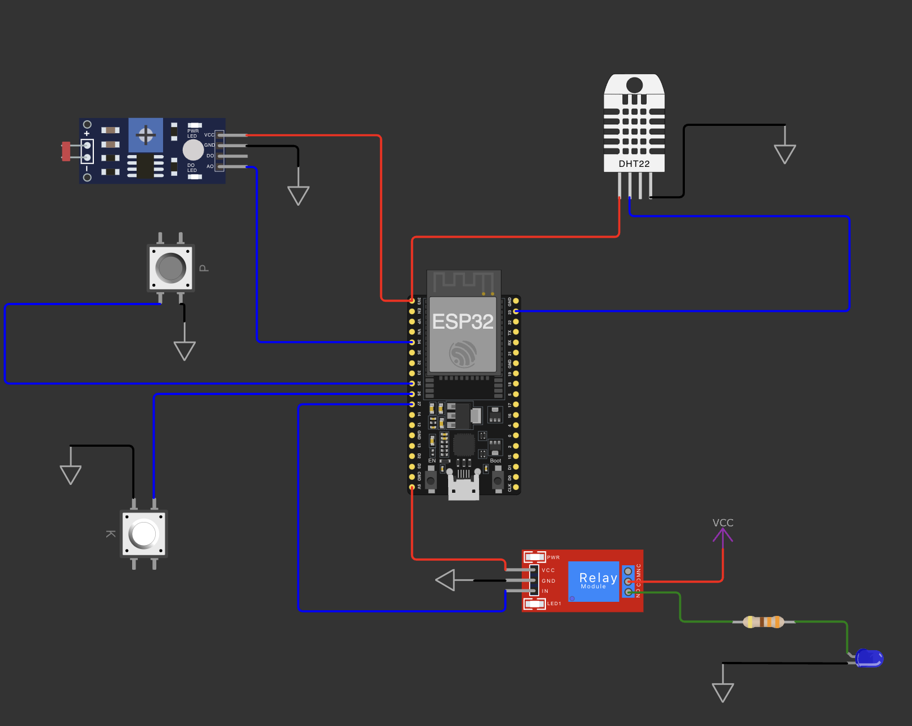

# FIAP - Faculdade de Informática e Administração Paulista

<p align="center">
    <a href="https://www.fiap.com.br/">
        
    </a>
</p>

<br>

# Nome do projeto
    Comstruindo uma Maquina Agricola

## Nome do grupo
    TerraFusion Tech - Sistema de Automação de Plantações

## 👩‍🏫 Professores:
### Tutor(a) 
- <a href="https://www.linkedin.com/in/lucas-gomes-moreira-15a8452a/">Lucas Gomes Moreira</a>
### Coordenador(a)
- <a href="https://www.linkedin.com/in/profandregodoi/">André Godoi</a>


## 📜 Descrição

O Sistema de Automação de Plantações é um projeto desenvolvido pela equipe TerraFusion Tech. O sistema é projetado para realizar a gestão e automação de irrigação agrícola, monitorando sensores de umidade, temperatura, pH e nutrientes, e controlando bombas de água para irrigação automatizada.

A lógica de controle da bomba de água é baseada no valor de umidade. Quando a umidade registrada é menor que 50%, o sistema liga a bomba de água automaticamente, enviando uma mensagem MQTT de ativação para o ESP32. Se a umidade é maior ou igual a 50%, o sistema desliga a bomba, enviando uma mensagem MQTT de desativação. Essa automação garante que o solo seja irrigado apenas quando necessário, economizando recursos e evitando irrigação excessiva.

### Sistema Automação de Planaçãoes




## 📁 Estrutura de pastas

Dentre os arquivos e pastas presentes na raiz do projeto, definem-se:

- <b>.github</b>: Nesta pasta ficarão os arquivos de configuração específicos do GitHub que ajudam a gerenciar e automatizar processos no repositório.

- <b>assets</b>: aqui estão os arquivos relacionados a elementos não-estruturados deste repositório, como imagens.

- <b>config</b>: Posicione aqui arquivos de configuração que são usados para definir parâmetros e ajustes do projeto.

- <b>document</b>: aqui estão todos os documentos do projeto que as atividades poderão pedir. Na subpasta "other", adicione documentos complementares e menos importantes.

- <b>src/scripts</b>: Posicione aqui scripts auxiliares para tarefas específicas do seu projeto. Exemplo: deploy, migrações de banco de dados, backups.

- <b>src</b>: Todo o código fonte criado para o desenvolvimento do projeto ao longo das 7 fases.

- <b>PlatformIO</b>: Pasta com os arquivos da automação (wokwi + hivemq).

- <b>log</b>: Pasta para guardar os logs da aplicação em um arquivo txt.

- <b>README.md</b>: arquivo que serve como guia e explicação geral sobre o projeto (o mesmo que você está lendo agora).


## 🔧 Como executar o código

#### Pré-requisitos
Antes de começar, verifique se você tem os seguintes pré-requisitos instalados em sua máquina:

#### 1. IDEs
Visual Studio Code (ou qualquer outra IDE de sua preferência)
PyCharm (opcional, caso você prefira um ambiente específico para Python)
#### 2. Serviços
Python 3.6 ou superior: O projeto foi desenvolvido e testado com Python 3.8.
Oracle Database: Para conectar-se ao banco de dados, você deve ter acesso a uma instância do Oracle.
#### 3. Bibliotecas
Bibliotecas Python: As bibliotecas necessárias estão listadas no arquivo requirements.txt. Abaixo estão algumas das principais bibliotecas utilizadas:

matplotlib: Para visualização de dados em forma de gráficos
pandas: Para manipulação de dados
SQLAlchemy: conexão com banco de dados
oracledb: Para conexão com o banco de dados Oracle
logging: Para Logs da aplicação

#### 4. Versões
* Python: >= 3.8
* Matplotlib: 3.9.2
* Pandas: 2.4.1
* OracleDB: 2.4.1
* Outras versões bibliotecas e versãoes seguem *requirements.txt*


#### Passos para configurar o ambiente:

1 - Com o código abaixo, crie um arquivo .env na raiz do seu projeto e preencha com os dados das suas variáveis de ambiente para conexão com o banco de dados:

```
echo -e "DB_USER=\nDB_PASSWORD=\nDB_DSN=" > .env
```
</br>

#### Antes de iniciar a aplicação em Python, vamos inicar a aplicação em so Simulador, nosso sistema é todo automatico, o sistema de irrigação envia via fila do hivemq os dados para a aplicação em Python que consome essses dados.

### Iniciando a automação ###

1. Setup da Maquina

#### Para macOS/Linux:

```
make setup1
```

#### Para Windows:
```
make setup2
```

2. Iniciar a Automação


```
make start
```
3. Executar o Projeto
Após compilar, você pode carregar e executar o código clicando no botão "Play" do diagram.json que está na pasta PlatformIO/Projects/agric_machine

<br />

4. Faça o setup do banco de dados


```
make setup_db
```

5. Rode em um novo terminal o sitema de filas.


```
make mqtt
```


6. Enquanto a automação acontece abra um novo terminal e chame o menu de opções 


```
make run
```


Dicas:
- 1 - Variáveis de Ambiente: Lembre-se de preencher o arquivo **.env** com os valores corretos para **DB_USER**, **DB_PASSWORD** e **DB_DSN** antes de rodar o aplicativo.<br />
- 2 - Antes de **ativar o ambiente** verifique qual é seu **sistema operacional** e escolha o comando correto.

Projeto Wokwi:

https://wokwi.com/projects/414307725830476801

## 🗃 Histórico de lançamentos

* 0.1.0 - 14/10/2024
 
* 0.1.1 - 13/11/2024
  
<!-- * 0.3.0 - XX/XX/2024
    * 
* 0.2.0 - XX/XX/2024
    * 
* 0.1.0 - XX/XX/2024 -->


## 📋 Licença

<p xmlns:cc="http://creativecommons.org/ns#" xmlns:dct="http://purl.org/dc/terms/"><a property="dct:title" rel="cc:attributionURL" href="https://github.com/agodoi/template">MODELO GIT FIAP</a> por <a rel="cc:attributionURL dct:creator" property="cc:attributionName" href="https://fiap.com.br">Fiap</a> está licenciado sobre <a href="http://creativecommons.org/licenses/by/4.0/?ref=chooser-v1" rel="license noopener noreferrer" style="display:inline-block;">Attribution 4.0 International</a>.</p>


